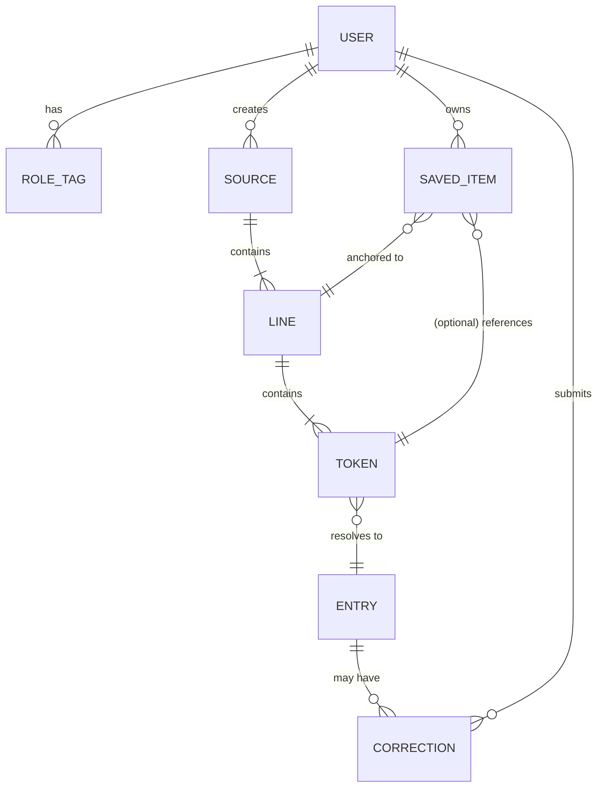

# KotobaVerse — Functional Specification

> [!info] Document status
> **Draft v0.1** — Living document. Sections marked `🕓 Deferred` are intentionally undecided. Sections marked `⚠️ Open` need explicit resolution before implementation.

> [!note] French version
> 🇫🇷 [[KotobaVerse - Spécification Fonctionnelle (FR)]]

---

## 1. Overview

KotobaVerse is a web-based text-processing tool built from the ground up to support Japanese language learning. Its premise is that authentic media — starting with **song lyrics** and later expanding to anime, books, video games, and films — is one of the most effective vocabulary anchors for learners, because words become attached to emotional and musical context rather than rote flashcards.

The application ingests a piece of media (initially: lyrics text), performs Japanese-specific linguistic analysis on it (tokenization, readings, definitions), and lets the user **curate** what they want to keep in their **personal dictionary**, anchored to the line and source where it was first encountered. Over time, the user builds a personal lexicon that reflects what they have actually consumed, not a generic word list.

V1.0 is a personal-learning + search tool. Later versions add spaced-repetition study, community translations, multi-media support, and richer reading modes.

---

## 2. Goals & Non-Goals

### 2.1 Goals

- Make it trivial to ingest Japanese lyrics and produce a clean, parsed view (tokenized words with readings and definitions).
- Give the learner total control over what enters their personal lexicon (per-word, per-line, or bulk).
- Anchor every saved word to its source context (the line, the song, the artist), so review is never decontextualized.
- Design the data model from day 1 to accommodate other media types (anime, books, films, games).
- Be usable both as a private learning tool and, eventually, a publicly hosted service.
- Serve as a portfolio-quality project.

### 2.2 Non-Goals (for v1.0)

- Not a replacement for Anki — no SRS in v1.0.
- Not a full streaming/audio platform — no audio playback in v1.0.
- Not a translation service — full sentence translation is deferred.
- Not a social network — no follows, comments, or likes in v1.0.
- Not multilingual beyond JA→EN/FR (no Korean, Chinese, etc.).

---

## 3. Personas

> [!example] Hiro — the solo learner *(primary, v1.0)*
> Intermediate Japanese learner. Listens to J-pop, J-rock, anime OSTs. Wants to look up unknown words from a song, save the meaningful ones with context, and review them later. Currently jumps between Jisho, Google Translate, and a notes app — wants one tool.

> [!example] Aiko — the community contributor *(v1.1+)*
> Advanced learner / bilingual. Wants to help improve translations, fix dictionary entries, import new content into the public library. Holds a `translator` or `importer` tag.

> [!example] Kenji — the administrator *(v1.0)*
> Project owner / trusted operator. Manages users, moderates submitted content, curates the global dictionary corrections, monitors usage.

---

## 4. Scope

### 4.1 In Scope — v1.0

- Google OAuth authentication
- Two roles: `user`, `admin`
- One Source type: `Song` (manual lyric paste only)
- Japanese tokenization + readings (furigana optional, kana fallback if no furigana)
- Per-word definitions from JMdict (English and French, with English fallback when French is missing)
- Personal dictionary: save words with link back to originating line and Source
- Search & filter across personal dictionary
- Basic admin panel: user management, moderation, dictionary correction
- UI in English and French

### 4.2 Out of Scope — v1.0 (deferred to later versions)

| Feature | Target version |
|---|---|
| Granular roles (`translator`, `importer`, etc.) | v1.1 |
| Sentence-level translation | v1.1 |
| Community translation submissions and flagging | v1.1 |
| Lyrics ingestion via API / scraping | v1.2 |
| SRS (spaced repetition study) | v1.2 |
| Reading mode (hover-to-define re-reading) | v1.2 |
| Cloze / fill-in-the-blank exercises | v1.3 |
| Additional Source types (anime, books, films, games) | v2.0 |
| Mobile app | v2.0 |
| Audio import / playback | v2.0+ |

### 4.3 Explicitly Out of Scope (never, or "not for years")

- Real-time multi-user editing of content
- E-commerce / paid tiers
- Native iOS / Android apps (PWA is the mobile path)

---

## 5. Glossary / Core Concepts

| Term | Meaning |
|---|---|
| **Source** | A piece of media a user ingests. v1.0 = `Song`. Later: `Anime`, `Book`, `Film`, `Game`. Abstract base type in code. |
| **Line** | A single line within a Source (one line of lyrics, one sentence of dialogue, etc.). |
| **Token** | A unit produced by the Japanese tokenizer — typically one word or particle. Carries surface form, reading, lemma, part of speech. |
| **Entry** | A dictionary record (from JMdict or KANJIDIC) corresponding to a Token's lemma. |
| **Personal Dictionary** | Per-user collection of words/expressions the user has explicitly saved. Each saved item is linked to its originating Line and Source. |
| **Correction** | A user- or admin-submitted override or addition to a dictionary Entry (a better translation, a note, etc.). |

---

## 6. User Roles & Permissions

> [!warning] ⚠️ Open question — stackable vs exclusive roles
> Working assumption: roles are **stackable tags** (a user can be both `translator` and `importer`). This is more flexible than mutually-exclusive role enums and matches the "labels" framing from early brainstorming. To be confirmed before implementation.

### 6.1 Role matrix

| Role | Available from | Can do |
|---|---|---|
| `user` *(default)* | v1.0 | Sign in, parse Sources, build personal dictionary, search, flag bad translations |
| `translator` | v1.1 | All `user` actions + submit/edit sentence translations and dictionary corrections |
| `importer` | v1.1 | All `user` actions + add new Sources to the public library, run API/scrape ingestion |
| `admin` | v1.0 | All actions + user mgmt, content moderation, dictionary curation, feature flags, stats dashboard |

### 6.2 Promotion model

- Default on signup: `user`
- Tags granted manually by `admin` from v1.1.
- v2+: self-application + admin approval, or automatic promotion based on contribution history.

---

## 7. Functional Requirements

### 7.1 Authentication & Account

- **F-AUTH-1**: The user can sign in via Google OAuth 2.0.
- **F-AUTH-2**: First-time sign-in auto-provisions a user with the `user` role.
- **F-AUTH-3**: The user can view their profile (email, display name, roles, account creation date) and sign out.
- **F-AUTH-4**: An admin can revoke a user's access.

### 7.2 Content Ingestion (Sources)

- **F-SRC-1**: A signed-in user can create a new `Song` Source by manually entering title, artist, and pasting lyrics.
- **F-SRC-2**: The user can edit metadata (title, artist) and re-edit the raw lyrics body of a Source they created.
- **F-SRC-3**: The Source schema must extend a generic `Source` base, so future Source types (`Anime`, `Book`, etc.) can be added without breaking changes.
- **F-SRC-4** *(deferred to v1.2)*: The user can ingest a Source via an external lyrics API or scraping.

### 7.3 Parsing & Analysis

- **F-PARSE-1**: On Source creation or save, the system runs Japanese tokenization on the raw text.
- **F-PARSE-2**: For each Token, the system computes: surface form, reading (kana), lemma (dictionary form), part of speech.
- **F-PARSE-3**: For each Token's lemma, the system looks up the corresponding Entry in JMdict.
- **F-PARSE-4**: When viewing a parsed Source, the user sees the original text rendered with per-Token interactive overlays revealing reading and definitions.
- **F-PARSE-5** *(optional in v1.0)*: Display furigana above kanji. If furigana rendering is not available, fall back to kana reading on hover/click.
- **F-PARSE-6** *(deferred)*: Whole-sentence/line translation displayed alongside.

### 7.4 Personal Dictionary

- **F-DICT-1**: From a parsed Source view, the user can save: (a) a single word, (b) a whole line (all its words), or (c) an arbitrary highlighted span (an expression).
- **F-DICT-2**: Every saved item stores a back-reference to its originating Line and Source.
- **F-DICT-3**: The user can add a personal note to any saved item.
- **F-DICT-4**: The user can mark items as `learning` / `known` / `mature` (status field; powers SRS in v1.2 but visible from v1.0).
- **F-DICT-5**: The user can browse their personal dictionary, filtered by Source, status, part of speech, or free-text search.
- **F-DICT-6**: Clicking a saved item navigates back to its originating Line in the original Source.

### 7.5 Search

- **F-SEARCH-1**: Global search within the user's personal dictionary by surface form, reading, lemma, definition, or note.
- **F-SEARCH-2** *(deferred to v1.1)*: Global search across all Sources the user has access to.

### 7.6 Translations & Corrections *(v1.1+)*

- **F-TRANS-1** *(v1.1)*: Any `user` can flag a JMdict entry's translation as inaccurate, with a comment.
- **F-TRANS-2** *(v1.1)*: A `translator` can submit a corrected translation, which sits on a "corrections layer" above the immutable JMdict base.
- **F-TRANS-3** *(v1.1)*: An `admin` can approve, reject, or revise corrections.
- **F-TRANS-4** *(v1.1)*: Sentence-level translation generation is performed via [deferred technology — see §11]; output is editable by `translator`s.

### 7.7 Admin Panel

- **F-ADM-1**: Admins can list, search, suspend, or delete users.
- **F-ADM-2**: Admins can promote/demote role tags.
- **F-ADM-3**: Admins can edit or remove any Source.
- **F-ADM-4**: Admins can moderate dictionary corrections (approve/reject/edit).
- **F-ADM-5**: Admins can toggle feature flags (e.g. "enable scraping", "enable LLM translation").
- **F-ADM-6** *(v1.1+)*: Admins see a stats dashboard (DAU/MAU, Sources created, words saved).

---

## 8. Data Model — High Level



**Entity sketch (TypeScript):**

```ts
type SourceKind = "song" | "anime" | "book" | "film" | "game"; // extensible

interface Source {
  id: string;
  kind: SourceKind;
  title: string;
  createdBy: UserId;
  createdAt: Date;
  // discriminated union by `kind` for kind-specific fields
}

interface Song extends Source {
  kind: "song";
  artist: string;
  rawLyrics: string;
}

interface Line {
  id: string;
  sourceId: string;
  index: number;          // line number within Source
  rawText: string;
  tokens: Token[];
}

interface Token {
  surface: string;        // as it appears in the line
  reading: string;        // kana
  lemma: string;          // dictionary form
  pos: string;            // part of speech
  entryId?: string;       // JMdict link
}

interface SavedItem {
  id: string;
  userId: string;
  lineId: string;
  tokenIndex?: number;    // null = whole line / expression
  span?: { start: number; end: number }; // for expressions
  status: "learning" | "known" | "mature";
  note?: string;
  createdAt: Date;
}
```

---

## 9. Core User Flows

### 9.1 First-time sign-in
1. User opens KotobaVerse → clicks "Sign in with Google".
2. OAuth round-trip → callback.
3. New `User` record created with role `user`.
4. Onboarding screen: "Paste your first song lyrics to get started."

### 9.2 Ingest and parse a song
1. User clicks "New Source → Song".
2. Enters title, artist, pastes lyrics into a textarea.
3. Saves → backend runs tokenization, lemmatization, JMdict lookup, persists `Source → Line[] → Token[]`.
4. Redirect to the parsed view.

### 9.3 Save a word to personal dictionary
1. In parsed view, user clicks a token.
2. Popup shows: reading, lemma, JMdict entry (EN + FR if available), part of speech.
3. User clicks "Save".
4. `SavedItem` created, linked to the Token, Line, and Source.
5. Visual indicator shows the word is now saved.

### 9.4 Review personal dictionary
1. User opens "My Dictionary".
2. Sees a list/grid of saved items with surface form, reading, short definition, source context preview.
3. Filters by Source, status, part of speech; full-text search.
4. Clicking an item opens detail view with full definition, note, and a "Show in context" link back to the originating Line.

---

## 10. Non-Functional Requirements

### 10.1 Performance
- Parsing a 50-line song completes in < 5 s server-side.
- Parsed Source view first paint < 2 s after navigation.

### 10.2 Security
- All endpoints require authentication except the public landing page.
- OAuth tokens stored server-side; only opaque session cookies on the client.
- Admin actions audit-logged (who, what, when).

### 10.3 Privacy
- Personal dictionaries are private by default. No public sharing in v1.0.
- User can request account + data deletion (GDPR).

### 10.4 Availability
- Best-effort for a solo-operated portfolio project. No SLA in v1.0.

### 10.5 Accessibility
- Keyboard navigable for core flows.
- Sufficient contrast (WCAG AA target).
- Furigana visible to screen readers (use `<ruby>` / `<rt>` semantic markup).

### 10.6 Internationalization
- UI available in English and French from v1.0.
- Architecture must allow adding more UI languages without code changes (i18n keys, no hard-coded strings).

---

## 11. Technical Considerations & Open Questions

### 11.1 Stack hints (non-binding)
- TypeScript end-to-end.
- Backend: Node.js (NestJS / Fastify / Hono — TBD).
- Frontend: React or SvelteKit — TBD.
- Database: PostgreSQL (relational structure fits the data model).
- Containerized via Docker Compose (already set up).
- Japanese tokenizer: candidates — `kuromoji.js`, `kuromojin`, or a backend `MeCab` / `Sudachi` via Python or Rust microservice.
- Dictionary data: **JMdict** (with the JMdict-FR subset for French) + **KANJIDIC** for kanji.

### 11.2 Open questions (must be resolved before / during implementation)

> [!warning] 🕓 OQ-1 — Shared corpus vs per-user content silos
> If User A parses *Lemon* by Kenshi Yonezu, can User B see and use that parsed version?
> Options: (a) shared global library; (b) per-user silos; (c) hybrid (admin-curated public library + private user imports).
> **Status:** undecided.

> [!warning] 🕓 OQ-2 — Sentence-level translation technology
> Options: (a) local small LLM; (b) cheap remote API (OpenAI, Anthropic, DeepL); (c) human-imported translations + community corrections; (d) hybrid.
> **Status:** undecided. Will be researched before v1.1.

> [!warning] 🕓 OQ-3 — Lyrics ingestion strategy and legality
> Manual paste is legally safe everywhere. API integrations (Genius, Musixmatch) require attribution and a TOS review. Scraping appears legal under French law for personal use, but unclear for a publicly hosted free service — requires a deeper legal check before enabling.
> **Status:** v1.0 = manual only. Full strategy TBD.

> [!warning] ⚠️ OQ-4 — Curation UX exact gestures
> Click-word / select-line / select-expression / "save all unknown" — all are wanted, but the exact interaction model (modifier keys, hover affordances, mobile gestures) is not designed yet.
> **Status:** to be prototyped in UI mockups.

> [!warning] ⚠️ OQ-5 — Role model: stackable tags vs exclusive roles
> Working assumption: stackable tags. Confirm before implementing the auth/permission layer.
> **Status:** working assumption.

> [!warning] 🕓 OQ-6 — French dictionary coverage gap
> JMdict-FR has weaker coverage than JMdict-EN. When a French definition is missing, options: (a) show English only; (b) machine-translate from English on the fly; (c) crowd-source via `translator`s.
> **Status:** v1.0 fallback = show English. Long-term strategy TBD.

---

## 12. Roadmap

### v1.0 — Personal learning MVP
- [ ] Google OAuth + 2 roles
- [ ] Manual song ingestion
- [ ] Tokenization + JMdict (EN/FR) per-word definitions
- [ ] Personal dictionary with context anchoring
- [ ] Search & filter
- [ ] Basic admin panel
- [ ] EN/FR UI

### v1.1 — Community translations
- [ ] Granular role tags (`translator`, `importer`)
- [ ] Translation flagging
- [ ] Correction submission + admin moderation
- [ ] Sentence-level translation (tech TBD)

### v1.2 — Study & ingestion
- [ ] SRS (spaced repetition) on saved items
- [ ] Reading mode (hover-to-define re-reading)
- [ ] API / scraping-based song ingestion

### v1.3 — Practice
- [ ] Cloze / fill-in-the-blank exercises
- [ ] User stats dashboard

### v2.0+ — Expansion
- [ ] Additional Source types (anime, books, films, games)
- [ ] PWA mobile experience
- [ ] (Maybe) audio playback / sync

---

## 13. Change Log

| Date | Version | Author | Notes |
|---|---|---|---|
| 2026-05-11 | 0.1 | — | Initial draft from brainstorming session |
