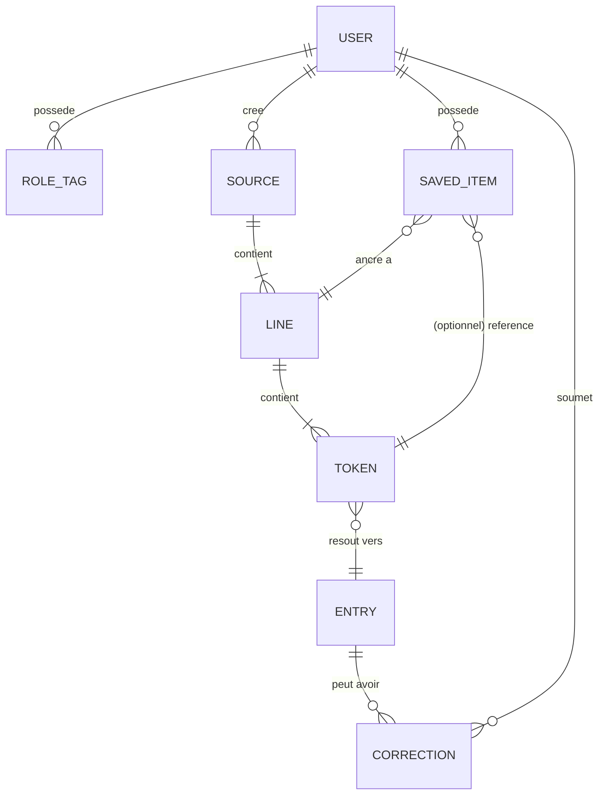

# KotobaVerse — Spécification fonctionnelle

> [!info] Statut du document
> **Brouillon v0.1** — Document vivant. Les sections marquées `🕓 Différé` sont volontairement non tranchées. Les sections marquées `⚠️ Ouvert` doivent être explicitement résolues avant implémentation.

> [!note] Version anglaise
> 🇬🇧 [[KotobaVerse - Functional Specification (EN)]]

---

## 1. Vue d'ensemble

KotobaVerse est un outil de traitement de texte web conçu de zéro pour soutenir l'apprentissage du japonais. Son postulat : les médias authentiques — en commençant par les **paroles de chansons**, puis à terme animes, livres, jeux vidéo et films — sont l'un des ancrages les plus efficaces pour mémoriser du vocabulaire, parce que les mots s'attachent à un contexte émotionnel et musical plutôt qu'à des cartes mémoire décontextualisées.

L'application ingère un média (initialement : un texte de paroles), réalise une analyse linguistique spécifique au japonais (tokenisation, lectures, définitions), et permet à l'utilisateur de **choisir** ce qu'il souhaite conserver dans son **dictionnaire personnel**, en gardant le lien vers la ligne et la source d'origine. Avec le temps, l'utilisateur construit un lexique personnel qui reflète ce qu'il a réellement consommé, pas une liste générique.

La v1.0 est un outil personnel d'apprentissage avec recherche. Les versions suivantes ajoutent la répétition espacée, les traductions communautaires, la prise en charge multi-médias, et des modes de lecture enrichis.

---

## 2. Objectifs et objectifs exclus

### 2.1 Objectifs

- Rendre trivial l'import de paroles japonaises et la production d'une vue analysée propre (mots tokenisés avec lectures et définitions).
- Donner à l'apprenant un contrôle total sur ce qui entre dans son lexique personnel (par mot, par ligne, ou en lot).
- Ancrer chaque mot sauvegardé à son contexte source (la ligne, la chanson, l'artiste), pour que la révision ne soit jamais décontextualisée.
- Concevoir le modèle de données dès le jour 1 pour accueillir d'autres types de médias (animes, livres, films, jeux).
- Être utilisable à la fois comme outil d'apprentissage privé et, à terme, comme service public hébergé.
- Servir de projet de qualité portfolio.

### 2.2 Objectifs exclus (pour la v1.0)

- Pas un remplaçant d'Anki — pas de répétition espacée en v1.0.
- Pas une plateforme audio / streaming — pas de lecture audio en v1.0.
- Pas un service de traduction — la traduction phrase par phrase est différée.
- Pas un réseau social — pas de follows, commentaires, likes en v1.0.
- Pas multilingue au-delà de JA→EN/FR (pas de coréen, chinois, etc.).

---

## 3. Personas

> [!example] Hiro — l'apprenant solo *(principal, v1.0)*
> Apprenant intermédiaire en japonais. Écoute J-pop, J-rock, OST d'anime. Veut chercher les mots inconnus d'une chanson, sauvegarder les plus pertinents avec leur contexte, et les réviser plus tard. Jongle aujourd'hui entre Jisho, Google Translate et une app de notes — il veut un outil unique.

> [!example] Aiko — la contributrice communautaire *(v1.1+)*
> Apprenante avancée / bilingue. Veut aider à améliorer les traductions, corriger les entrées de dictionnaire, importer du nouveau contenu dans la bibliothèque publique. Porte une étiquette `translator` ou `importer`.

> [!example] Kenji — l'administrateur *(v1.0)*
> Porteur du projet / opérateur de confiance. Gère les utilisateurs, modère les contenus soumis, organise les corrections de dictionnaire, surveille l'utilisation.

---

## 4. Périmètre

### 4.1 Dans le périmètre — v1.0

- Authentification Google OAuth
- Deux rôles : `user`, `admin`
- Un seul type de Source : `Song` (collage manuel des paroles uniquement)
- Tokenisation japonaise + lectures (furigana optionnel, repli sur kana sinon)
- Définitions par mot depuis JMdict (anglais et français, avec repli anglais si le français manque)
- Dictionnaire personnel : sauvegarde des mots avec lien retour vers la ligne et la Source d'origine
- Recherche et filtres sur le dictionnaire personnel
- Panneau admin basique : gestion utilisateurs, modération, corrections de dictionnaire
- Interface en anglais et en français

### 4.2 Hors périmètre — v1.0 (différé aux versions ultérieures)

| Fonctionnalité | Version cible |
|---|---|
| Rôles granulaires (`translator`, `importer`, etc.) | v1.1 |
| Traduction phrase par phrase | v1.1 |
| Soumissions et signalements de traductions communautaires | v1.1 |
| Ingestion de paroles via API / scraping | v1.2 |
| SRS (répétition espacée) | v1.2 |
| Mode lecture (relecture avec définitions au survol) | v1.2 |
| Exercices à trous (cloze) | v1.3 |
| Types de Source supplémentaires (anime, livres, films, jeux) | v2.0 |
| Application mobile | v2.0 |
| Import / lecture audio | v2.0+ |

### 4.3 Explicitement hors périmètre (jamais, ou « pas avant des années »)

- Édition multi-utilisateur temps réel du contenu
- E-commerce / offres payantes
- Apps natives iOS / Android (la voie mobile est la PWA)

---

## 5. Glossaire / Concepts clés

| Terme | Signification |
|---|---|
| **Source** | Un média qu'un utilisateur ingère. v1.0 = `Song`. Plus tard : `Anime`, `Book`, `Film`, `Game`. Type de base abstrait dans le code. |
| **Line** | Une ligne unique au sein d'une Source (une ligne de paroles, une phrase de dialogue, etc.). |
| **Token** | Une unité produite par le tokeniseur japonais — typiquement un mot ou une particule. Contient la forme de surface, la lecture, le lemme, la nature grammaticale. |
| **Entry** | Une entrée de dictionnaire (depuis JMdict ou KANJIDIC) correspondant au lemme d'un Token. |
| **Dictionnaire personnel** | Collection par utilisateur des mots / expressions explicitement sauvegardés. Chaque élément sauvegardé est lié à sa Line et sa Source d'origine. |
| **Correction** | Un ajout ou un remplacement soumis par un utilisateur ou un admin sur une Entry de dictionnaire (meilleure traduction, note, etc.). |

---

## 6. Rôles et permissions

> [!warning] ⚠️ Question ouverte — rôles cumulables ou exclusifs
> Hypothèse de travail : les rôles sont des **étiquettes cumulables** (un utilisateur peut être à la fois `translator` et `importer`). Plus flexible que des enums exclusifs et cohérent avec le mot « labels » du brainstorming initial. À confirmer avant implémentation.

### 6.1 Matrice des rôles

| Rôle | Disponible à partir de | Peut faire |
|---|---|---|
| `user` *(défaut)* | v1.0 | Se connecter, analyser des Sources, construire son dictionnaire personnel, rechercher, signaler des traductions erronées |
| `translator` | v1.1 | Toutes les actions `user` + soumettre / éditer traductions de phrases et corrections de dictionnaire |
| `importer` | v1.1 | Toutes les actions `user` + ajouter de nouvelles Sources à la bibliothèque publique, lancer une ingestion via API / scraping |
| `admin` | v1.0 | Toutes les actions + gestion utilisateurs, modération, organisation du dictionnaire, feature flags, tableau de bord stats |

### 6.2 Modèle de promotion

- Par défaut à l'inscription : `user`
- Étiquettes attribuées manuellement par un `admin` à partir de la v1.1.
- v2+ : auto-candidature + validation admin, ou promotion automatique selon historique de contribution.

---

## 7. Exigences fonctionnelles

### 7.1 Authentification et compte

- **F-AUTH-1** : L'utilisateur peut se connecter via Google OAuth 2.0.
- **F-AUTH-2** : La première connexion provisionne automatiquement un compte avec le rôle `user`.
- **F-AUTH-3** : L'utilisateur peut consulter son profil (email, nom d'affichage, rôles, date de création) et se déconnecter.
- **F-AUTH-4** : Un admin peut révoquer l'accès d'un utilisateur.

### 7.2 Ingestion de contenu (Sources)

- **F-SRC-1** : Un utilisateur connecté peut créer une nouvelle Source `Song` en saisissant manuellement titre, artiste et paroles.
- **F-SRC-2** : L'utilisateur peut éditer les métadonnées (titre, artiste) et le corps brut des paroles d'une Source qu'il a créée.
- **F-SRC-3** : Le schéma de Source doit étendre un type de base générique `Source`, pour que de futurs types (`Anime`, `Book`, etc.) puissent être ajoutés sans changement cassant.
- **F-SRC-4** *(différé en v1.2)* : L'utilisateur peut ingérer une Source via une API externe ou du scraping.

### 7.3 Analyse et parsing

- **F-PARSE-1** : À la création ou à la sauvegarde d'une Source, le système exécute la tokenisation japonaise sur le texte brut.
- **F-PARSE-2** : Pour chaque Token, le système calcule : forme de surface, lecture (kana), lemme (forme du dictionnaire), nature grammaticale.
- **F-PARSE-3** : Pour le lemme de chaque Token, le système recherche l'Entry correspondante dans JMdict.
- **F-PARSE-4** : En consultant une Source analysée, l'utilisateur voit le texte d'origine rendu avec, sur chaque Token, un overlay interactif révélant la lecture et la définition.
- **F-PARSE-5** *(optionnel en v1.0)* : Afficher les furigana au-dessus des kanji. Si le rendu furigana n'est pas disponible, repli sur la lecture kana au survol / clic.
- **F-PARSE-6** *(différé)* : Traduction phrase / ligne complète affichée à côté.

### 7.4 Dictionnaire personnel

- **F-DICT-1** : Depuis la vue d'une Source analysée, l'utilisateur peut sauvegarder : (a) un mot unique, (b) une ligne entière (tous ses mots), ou (c) un segment surligné arbitraire (une expression).
- **F-DICT-2** : Chaque élément sauvegardé stocke une référence retour vers sa Line et sa Source d'origine.
- **F-DICT-3** : L'utilisateur peut ajouter une note personnelle à tout élément sauvegardé.
- **F-DICT-4** : L'utilisateur peut marquer les éléments comme `learning` / `known` / `mature` (champ de statut ; utilisé par la SRS en v1.2 mais visible dès la v1.0).
- **F-DICT-5** : L'utilisateur peut parcourir son dictionnaire personnel, filtré par Source, statut, nature grammaticale, ou recherche plein texte.
- **F-DICT-6** : Cliquer sur un élément sauvegardé renvoie vers sa Line d'origine dans la Source d'origine.

### 7.5 Recherche

- **F-SEARCH-1** : Recherche globale dans le dictionnaire personnel de l'utilisateur par forme de surface, lecture, lemme, définition, ou note.
- **F-SEARCH-2** *(différé en v1.1)* : Recherche globale sur toutes les Sources auxquelles l'utilisateur a accès.

### 7.6 Traductions et corrections *(v1.1+)*

- **F-TRANS-1** *(v1.1)* : Tout `user` peut signaler une traduction d'entrée JMdict comme inexacte, avec un commentaire.
- **F-TRANS-2** *(v1.1)* : Un `translator` peut soumettre une traduction corrigée, qui s'installe sur une « couche de corrections » au-dessus de la base JMdict immuable.
- **F-TRANS-3** *(v1.1)* : Un `admin` peut approuver, rejeter, ou réviser les corrections.
- **F-TRANS-4** *(v1.1)* : La génération de traductions phrase par phrase utilise [technologie différée — voir §11] ; sortie éditable par les `translator`s.

### 7.7 Panneau admin

- **F-ADM-1** : Les admins peuvent lister, rechercher, suspendre ou supprimer des utilisateurs.
- **F-ADM-2** : Les admins peuvent attribuer / retirer les étiquettes de rôle.
- **F-ADM-3** : Les admins peuvent éditer ou supprimer n'importe quelle Source.
- **F-ADM-4** : Les admins peuvent modérer les corrections de dictionnaire (approuver / rejeter / éditer).
- **F-ADM-5** : Les admins peuvent basculer les feature flags (ex. « activer scraping », « activer LLM de traduction »).
- **F-ADM-6** *(v1.1+)* : Les admins voient un tableau de bord stats (DAU/MAU, Sources créées, mots sauvegardés).

---

## 8. Modèle de données — niveau macro



**Esquisse d'entités (TypeScript) :**

```ts
type SourceKind = "song" | "anime" | "book" | "film" | "game"; // extensible

interface Source {
  id: string;
  kind: SourceKind;
  title: string;
  createdBy: UserId;
  createdAt: Date;
  // union discriminée par `kind` pour les champs spécifiques
}

interface Song extends Source {
  kind: "song";
  artist: string;
  rawLyrics: string;
}

interface Line {
  id: string;
  sourceId: string;
  index: number;          // numéro de ligne dans la Source
  rawText: string;
  tokens: Token[];
}

interface Token {
  surface: string;        // tel qu'apparaissant dans la ligne
  reading: string;        // kana
  lemma: string;          // forme du dictionnaire
  pos: string;            // nature grammaticale
  entryId?: string;       // lien JMdict
}

interface SavedItem {
  id: string;
  userId: string;
  lineId: string;
  tokenIndex?: number;    // null = ligne / expression entière
  span?: { start: number; end: number }; // pour expressions
  status: "learning" | "known" | "mature";
  note?: string;
  createdAt: Date;
}
```

---

## 9. Parcours utilisateur principaux

### 9.1 Première connexion
1. L'utilisateur ouvre KotobaVerse → clique « Se connecter avec Google ».
2. Aller-retour OAuth → callback.
3. Création d'un nouvel enregistrement `User` avec rôle `user`.
4. Écran d'accueil : « Collez les paroles de votre première chanson pour commencer. »

### 9.2 Ingérer et analyser une chanson
1. L'utilisateur clique « Nouvelle Source → Chanson ».
2. Saisit titre, artiste, colle les paroles dans une zone de texte.
3. Sauvegarde → le backend exécute tokenisation, lemmatisation, recherche JMdict, persiste `Source → Line[] → Token[]`.
4. Redirection vers la vue analysée.

### 9.3 Sauvegarder un mot dans le dictionnaire personnel
1. Dans la vue analysée, l'utilisateur clique sur un token.
2. Une popup affiche : lecture, lemme, entrée JMdict (EN + FR si disponible), nature grammaticale.
3. L'utilisateur clique « Sauvegarder ».
4. Création d'un `SavedItem`, lié au Token, à la Line et à la Source.
5. Un indicateur visuel montre que le mot est maintenant sauvegardé.

### 9.4 Réviser le dictionnaire personnel
1. L'utilisateur ouvre « Mon dictionnaire ».
2. Voit une liste / grille des éléments sauvegardés avec forme de surface, lecture, définition courte, aperçu du contexte source.
3. Filtre par Source, statut, nature grammaticale ; recherche plein texte.
4. Cliquer sur un élément ouvre la vue détaillée avec la définition complète, la note, et un lien « Voir en contexte » vers la Line d'origine.

---

## 10. Exigences non fonctionnelles

### 10.1 Performance
- L'analyse d'une chanson de 50 lignes s'achève en < 5 s côté serveur.
- Premier rendu de la vue Source analysée en < 2 s après navigation.

### 10.2 Sécurité
- Tous les endpoints exigent une authentification, sauf la page d'accueil publique.
- Tokens OAuth stockés côté serveur ; côté client, uniquement des cookies de session opaques.
- Actions admin tracées dans un audit log (qui, quoi, quand).

### 10.3 Vie privée
- Dictionnaires personnels privés par défaut. Pas de partage public en v1.0.
- L'utilisateur peut demander la suppression de son compte et de ses données (RGPD).

### 10.4 Disponibilité
- « Best effort » pour un projet portfolio opéré par une seule personne. Pas de SLA en v1.0.

### 10.5 Accessibilité
- Navigation au clavier pour les parcours principaux.
- Contraste suffisant (cible WCAG AA).
- Furigana visible pour les lecteurs d'écran (balises sémantiques `<ruby>` / `<rt>`).

### 10.6 Internationalisation
- Interface disponible en français et en anglais dès la v1.0.
- L'architecture doit permettre d'ajouter d'autres langues sans changement de code (clés i18n, pas de chaînes en dur).

---

## 11. Choix techniques et questions ouvertes

### 11.1 Indications de stack (non contraignant)
- TypeScript de bout en bout.
- Backend : Node.js (NestJS / Fastify / Hono — à décider).
- Frontend : React ou SvelteKit — à décider.
- Base de données : PostgreSQL (la structure relationnelle convient au modèle).
- Conteneurisation via Docker Compose (déjà en place).
- Tokeniseur japonais : candidats — `kuromoji.js`, `kuromojin`, ou un microservice backend `MeCab` / `Sudachi` (Python ou Rust).
- Données de dictionnaire : **JMdict** (avec le sous-ensemble JMdict-FR pour le français) + **KANJIDIC** pour les kanji.

### 11.2 Questions ouvertes (à résoudre avant / pendant l'implémentation)

> [!warning] 🕓 QO-1 — Corpus partagé vs silos par utilisateur
> Si l'utilisateur A analyse *Lemon* de Kenshi Yonezu, est-ce que l'utilisateur B peut voir et utiliser cette version analysée ?
> Options : (a) bibliothèque globale partagée ; (b) silos par utilisateur ; (c) hybride (bibliothèque publique organisée par admins + imports privés).
> **Statut :** non tranché.

> [!warning] 🕓 QO-2 — Technologie de traduction phrase par phrase
> Options : (a) petit LLM local ; (b) API distante peu coûteuse (OpenAI, Anthropic, DeepL) ; (c) traductions humaines importées + corrections communautaires ; (d) hybride.
> **Statut :** non tranché. À étudier avant la v1.1.

> [!warning] 🕓 QO-3 — Stratégie et légalité de l'ingestion de paroles
> Le collage manuel est légalement sûr partout. Les intégrations API (Genius, Musixmatch) demandent attribution et revue de CGU. Le scraping semble légal en France pour usage personnel, mais flou pour un service public gratuit hébergé — vérification juridique nécessaire avant activation.
> **Statut :** v1.0 = manuel uniquement. Stratégie complète à venir.

> [!warning] ⚠️ QO-4 — Détails UX de la curation
> Clic-mot / sélection-ligne / sélection-expression / « tout sauvegarder l'inconnu » — tous voulus, mais le modèle d'interaction exact (touches modificatrices, affordances au survol, gestes mobiles) n'est pas encore conçu.
> **Statut :** à prototyper en maquettes UI.

> [!warning] ⚠️ QO-5 — Modèle de rôles : étiquettes cumulables vs rôles exclusifs
> Hypothèse de travail : étiquettes cumulables. À confirmer avant d'implémenter la couche auth / permissions.
> **Statut :** hypothèse de travail.

> [!warning] 🕓 QO-6 — Couverture du dictionnaire français
> JMdict-FR a une couverture plus faible que JMdict-EN. Quand une définition française manque, options : (a) afficher seulement l'anglais ; (b) traduire automatiquement depuis l'anglais à la volée ; (c) crowdsourcer via les `translator`s.
> **Statut :** v1.0 = repli sur l'anglais. Stratégie long terme à définir.

---

## 12. Feuille de route

### v1.0 — MVP d'apprentissage personnel
- [ ] Google OAuth + 2 rôles
- [ ] Ingestion manuelle de chansons
- [ ] Tokenisation + définitions JMdict (EN/FR) par mot
- [ ] Dictionnaire personnel avec ancrage contextuel
- [ ] Recherche et filtres
- [ ] Panneau admin basique
- [ ] Interface EN/FR

### v1.1 — Traductions communautaires
- [ ] Étiquettes de rôle granulaires (`translator`, `importer`)
- [ ] Signalement de traductions
- [ ] Soumission de corrections + modération admin
- [ ] Traduction phrase par phrase (techno à définir)

### v1.2 — Étude et ingestion
- [ ] SRS (répétition espacée) sur les éléments sauvegardés
- [ ] Mode lecture (relecture avec définitions au survol)
- [ ] Ingestion de chansons via API / scraping

### v1.3 — Pratique
- [ ] Exercices à trous (cloze)
- [ ] Tableau de bord stats utilisateur

### v2.0+ — Expansion
- [ ] Types de Source supplémentaires (animes, livres, films, jeux)
- [ ] Expérience mobile PWA
- [ ] (Peut-être) lecture audio / synchronisation

---

## 13. Historique des modifications

| Date | Version | Auteur | Notes |
|---|---|---|---|
| 2026-05-11 | 0.1 | — | Brouillon initial issu de la session de brainstorming |
