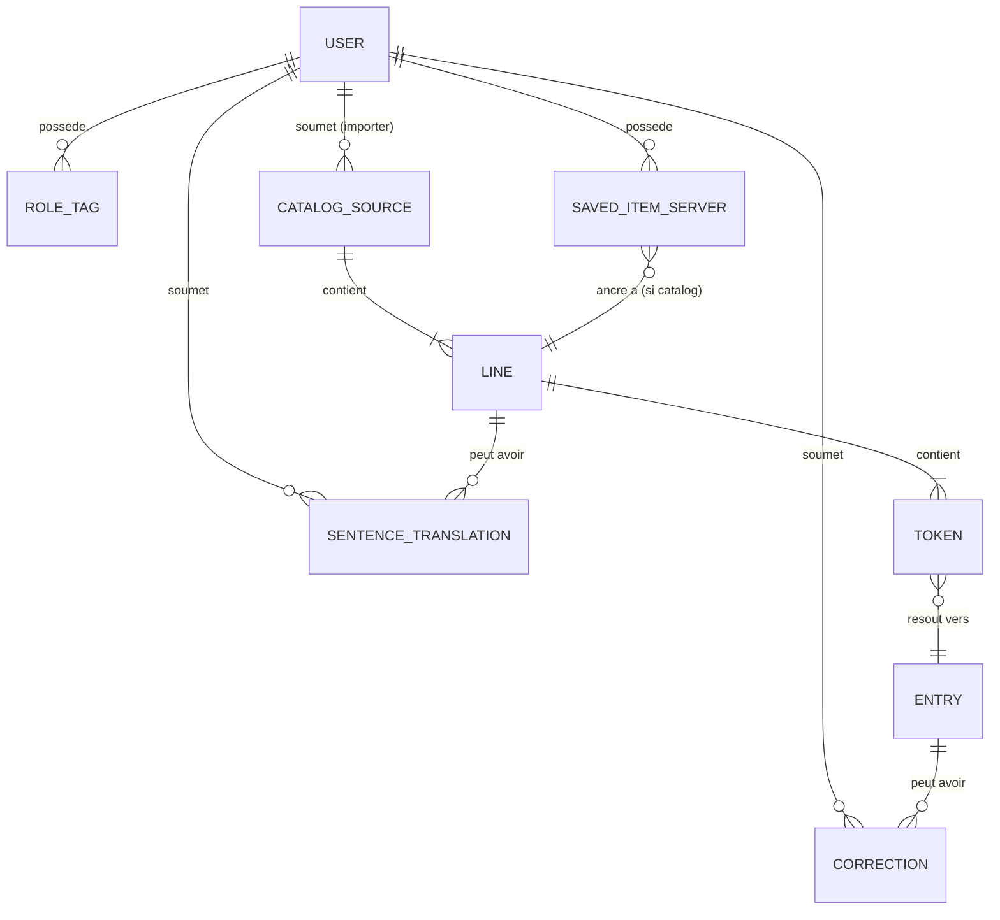

# KotobaVerse — Spécification fonctionnelle v1.0

> [!info] Convention de versioning
> Ce document utilise un **versioning à deux axes** :
> - **`document_version`** (ce document, actuellement `v1.0`) : suit la maturation conceptuelle de la spécification elle-même. Bumpé en mineur (`v1.0.x`) pour clarifications, en majeur (`v1.1`, `v2.0`) pour réécritures substantielles ou ruptures.
> - **Phases produit** (`v1.0-alpha`, `v1.0-beta`, `v1.1`, etc.) : étapes de réalisation du produit KotobaVerse, décrites dans des sections distinctes ci-dessous.
>
> Une même version de document peut décrire plusieurs phases produit. Le passage `v0.3 → v1.0` du document marque la rupture conceptuelle (pivot local-first hybride, Kotlin end-to-end, analyse juridique structurée).

> [!warning] Rupture vs v0.3 (2026-05-16)
> Ce document remplace la spec v0.3 (architecture SaaS pure, scraper Python serveur, microservices envisagés). Les versions v0.x sont **archivées** comme historique de pensée. Ne pas s'y référer pour les décisions actuelles.

> [!info] Statut
> **Document v1.0 — Stable.** Couvre les phases produit `v1.0-alpha` (en cours d'implémentation), `v1.0-beta` (planifiée) et `v1.1` (esquissée). Les sections marquées `🕓 Différé` sont volontairement non tranchées. Les sections marquées `⚠️ Ouvert` doivent être explicitement résolues avant implémentation de leur phase de rattachement.

---

## 1. Philosophie architecturale

KotobaVerse repose sur une **séparation explicite entre deux catégories de données**, motivée par des contraintes juridiques (droit d'auteur sur les paroles) et techniques (offline-first pour la lecture mobile).

### 1.1 Données neutres ou créées par les utilisateurs → **hébergées serveur**

- Comptes utilisateurs (OAuth Google)
- Catalogue de métadonnées (titres, artistes, MBID via MusicBrainz) — **faits non protégeables**
- Catalogue d'**œuvres libres de droits** ou sous licence permissive, curé par les rôles `admin` et `importer`
- JMdict + KANJIDIC (licence CC)
- Corrections JMdict soumises par la communauté
- Traductions de phrases produites par les utilisateurs (**créations originales** des `translator`s)
- Statistiques agrégées et anonymisées

### 1.2 Contenu potentiellement protégé → **stocké localement sur le device de l'utilisateur** (v1.0-beta+)

- Le texte brut des Sources importées par l'utilisateur (paroles scrapées, collages personnels)
- Les `Line`s et `Token`s issus de la tokenisation locale
- Les `SavedItem`s du dictionnaire personnel référencent le contenu local par **pointeur opaque** (catalog ID côté serveur, contenu côté client)

### 1.3 Garanties que cette séparation procure

1. **Défensibilité juridique** du service hébergé : statut d'hébergeur passif au sens de l'article 6 de la LCEN, framework des "outils neutres avec usage substantiel non-contrefaisant" (jurisprudence VLC, youtube-dl, Audacity).
2. **Privacy by design** : le contenu personnel de l'utilisateur ne quitte jamais son device en v1.0 ; en v1.1, transit possible mais chiffré end-to-end.
3. **Fonctionnement offline** pour la pratique d'apprentissage (transport, métro, voyages).
4. **Scalabilité serveur** : le contenu lourd ne touche pas la BDD partagée.

### 1.4 Cadre juridique détaillé

Le découpage architectural en deux phases (v1.0-alpha sur catalogue PD/CC côté serveur, v1.0-beta avec tokenisation client pour contenu utilisateur) n'est pas un choix arbitraire ni purement défensif : il découle directement de l'application du Code de la propriété intellectuelle (CPI) français et de la jurisprudence européenne.

#### 1.4.1 Référentiel applicable

KotobaVerse est opéré depuis la France, donc soumis :
- Au droit français du droit d'auteur (CPI, livre I) pour la qualification des actes de reproduction
- Au régime de responsabilité des intermédiaires techniques (LCEN art. 6) pour le statut du serveur en tant qu'hébergeur
- À la directive InfoSoc 2001/29/CE (transposée notamment aux art. L.122-5 CPI) et à la jurisprudence contraignante de la CJUE

La durée de protection est régie par l'art. **L.123-1 CPI** : 70 ans post mortem auctoris (pmm), **sans clause de grand-père**, indépendamment de la nationalité ou du domicile de l'auteur.

#### 1.4.2 Tokenisation serveur en v1.0-alpha — trivialement légale

Le catalogue v1.0-alpha est composé exclusivement de :
- Œuvres en domaine public (chants traditionnels, compositions dont l'auteur est décédé depuis plus de 70 ans)
- Œuvres sous licence Creative Commons compatible (CC0, CC-BY, Vocaloid CC)
- Productions originales contributives (traductions produites par les `translator`s)

Sur ces contenus, **aucun droit patrimonial n'est en cours**. L'article L.122-4 CPI (réservation du droit de reproduction au titulaire) ne s'applique pas — soit parce qu'il n'y a pas de titulaire (PD), soit parce que le titulaire a accordé une licence explicite (CC). Les exceptions de l'art. L.122-5 CPI (copie privée, copie technique transitoire, etc.) deviennent **sans objet** : il n'y a pas de monopole à exciper d'exception.

**Conséquence** : la tokenisation serveur en v1.0-alpha, la persistance des `Token`s en base, l'indexation, la redistribution via l'API REST — tous ces actes sont juridiquement neutres. Aucune analyse au cas par cas requise.

**Obligation opérationnelle** : la curation par les rôles `importer` et `admin` doit produire une **attestation de licence vérifiable** pour chaque entrée (champ `licenseAttestation` du modèle `CatalogSource`). C'est cette attestation qui matérialise la défensibilité de l'architecture en cas de contestation.

#### 1.4.3 Tokenisation côté client en v1.0-beta — sans question à soulever

En v1.0-beta, l'utilisateur peut importer du contenu personnel potentiellement protégé (paroles scrapées d'uta-net, collages depuis Genius, etc.). Trois actes successifs sont à qualifier :

| Acte | Acteur | Qualification juridique |
|---|---|---|
| Récupération (scrape ou collage) | Utilisateur | Reproduction. Couverte par **L.122-5 2°** (copie privée) si source licite et usage strictement personnel |
| Tokenisation locale | Utilisateur (via son device) | Reproduction technique de la copie privée. Reste sous L.122-5 2° puisque même acteur, même finalité |
| Stockage local | Utilisateur | Conservation de la copie privée. OK sous L.122-5 2° tant que pas de partage |

Toute la chaîne reste sous l'exception **copie privée** de l'art. L.122-5 2° CPI, qui exige source licite, usage strictement personnel du copiste et absence d'usage collectif. La tokenisation étant exécutée sur le device de l'utilisateur, le copiste reste l'utilisateur de bout en bout — aucun nouvel acteur n'entre dans la chaîne. **Pas de question juridique à soulever.**

#### 1.4.4 Pourquoi pas la tokenisation serveur en v1.0-beta

Une architecture alternative aurait été d'envoyer le contenu utilisateur en clair au serveur pour tokenisation, puis de chiffrer le résultat pour stockage. Cette alternative serait *défendable* sous l'art. **L.122-5 6° CPI** (copie technique transitoire), mais devrait satisfaire les **quatre conditions cumulatives strictes** posées par la CJUE (*Infopaq I et II*, C-5/08 et C-302/10 ; *Public Relations Consultants v NLA*, C-360/13) :

1. Caractère transitoire ou accessoire
2. Partie intégrante d'un procédé technique
3. Finalité unique : permettre une utilisation licite ou la transmission par un intermédiaire
4. Pas de valeur économique propre

La condition 4 se fragilise dès qu'un service devient commercial (CJUE *Filmspeler* C-527/15 ; *VCAST* C-265/16, qui a refusé d'étendre l'exception de copie privée à un opérateur commercial intermédiaire effectuant lui-même la reproduction). Pour un projet susceptible de basculer en SaaS payant, choisir l'architecture **client-side** est structurellement plus robuste et évite d'avoir à argumenter le respect cumulatif de ces quatre conditions en cas de contentieux.

#### 1.4.5 Récapitulatif des autres choix juridiques

- **Scraping côté client en v1.0-beta** : déplace la responsabilité éditoriale du serveur vers l'utilisateur. Le service KotobaVerse reste un outil neutre au sens de la jurisprudence VLC / youtube-dl / Audacity. (QO-3 résolue.)
- **Stockage chiffré E2E en v1.1** : permet au serveur de bénéficier du **statut d'hébergeur passif** au sens de LCEN art. 6, sur le modèle ProtonDrive / Tresorit. Le serveur n'a pas la capacité technique de lire le contenu, donc pas de connaissance manifeste, donc pas de responsabilité éditoriale.
- **Métadonnées catalog (titre, artiste, MBID)** : sont des **faits** non protégeables par le droit d'auteur (art. L.112-1 CPI exige une œuvre de l'esprit originale). Leur centralisation côté serveur ne pose aucun problème, même pour des œuvres protégées.
- **Traduction phrase-par-phrase générée par LLM** : sur du contenu PD, la traduction est une **création originale** (œuvre dérivée d'une œuvre PD), dont les droits naissent au profit du traducteur — ici, KotobaVerse via le `translator` validateur. JASRAC ne gère pas les droits de traduction au Japon, donc pas de complication.

#### 1.4.6 Durée de protection et sourcing Aozora Bunko

Si le catalogue v1.0-alpha intègre Aozora Bunko (cf. QO-10), une vigilance particulière est requise sur la durée de protection. **Aozora applique le droit japonais** (anciennement 50 ans, désormais 70 ans pmm depuis la révision de 2018, avec clause de grand-père pour les auteurs morts avant le 31/12/1967). **KotobaVerse opère depuis la France**, donc l'art. **L.123-1 CPI** s'applique : **70 ans pmm**, **sans clause de grand-père**.

Un auteur japonais décédé en 1960, par exemple, est domaine public au Japon depuis 2010 (50 ans pmm avant réforme), mais ne le sera en France qu'au 1er janvier 2031 (70 ans pmm + règle du calcul en années entières de l'art. L.123-2).

**Obligation opérationnelle** : le pipeline d'ingestion Aozora doit filtrer sur la date de décès de l'auteur en appliquant la règle française des 70 ans pmm, **pas** la règle japonaise. Métadonnée requise pour chaque entrée : `author_death_year`, et critère de validation à l'ingestion : `(current_year - author_death_year) > 70`. Le filtre s'applique côté serveur au moment de la soumission par un `importer`, et la validation par l'`admin` doit vérifier explicitement ce critère.

---

## 2. Vue d'ensemble

KotobaVerse est un outil de traitement de texte conçu de zéro pour soutenir l'apprentissage du japonais. Son postulat : les médias authentiques — en commençant par les **paroles de chansons**, puis à terme animes, livres, jeux vidéo, films — sont l'un des ancrages les plus efficaces pour mémoriser du vocabulaire, parce que les mots s'attachent à un contexte émotionnel plutôt qu'à des cartes mémoire décontextualisées.

L'application ingère un média, réalise une analyse linguistique spécifique au japonais (tokenisation, lectures, définitions JMdict), et permet à l'utilisateur de **choisir** ce qu'il souhaite conserver dans son **dictionnaire personnel**, en gardant le lien vers la ligne et la Source d'origine.

La cible d'usage principale est le **mobile** (lecture et révision en déplacement), avec un client Desktop comme complément pour le travail approfondi.

---

## 3. Objectifs et objectifs exclus

### 3.1 Objectifs

- Rendre fluide l'analyse et la révision de contenu japonais (mots tokenisés avec lectures et définitions).
- Donner à l'apprenant un contrôle total sur ce qui entre dans son lexique personnel.
- Ancrer chaque mot sauvegardé à son contexte source.
- Concevoir le modèle de données dès le jour 1 pour accueillir d'autres types de médias.
- Être utilisable sur mobile en priorité, Desktop en secondaire.
- Servir de projet de qualité portfolio démontrant **Kotlin idiomatique end-to-end** (backend + multiplatform client).

### 3.2 Objectifs exclus (pour v1.0)

- Pas un remplaçant d'Anki : pas de répétition espacée en v1.0
- Pas une plateforme audio / streaming : pas de lecture audio en v1.0
- Pas un service de streaming pirate : aucun contenu copyrighté n'est hébergé par KotobaVerse
- Pas un réseau social : pas de follows, commentaires, likes en v1.0
- Pas multilingue au-delà de JA→EN/FR

---

## 4. Personas

> [!example] Hiro — l'apprenant solo *(principal, v1.0-alpha et beta)*
> Apprenant intermédiaire. Écoute J-pop, J-rock, OST d'anime — mais comprend qu'en v1.0-alpha le catalogue se limitera à des œuvres libres de droits (classiques Aozora, traditionnels, Vocaloid CC). En v1.0-beta, importera ses propres chansons depuis Genius / uta-net / lyrical-nonsense via l'app, stockées localement sur son téléphone. Use case : 30 min dans le métro avec son téléphone, lecture d'une chanson + sauvegarde de 5-10 mots.

> [!example] Aiko — la contributrice communautaire *(v1.0-alpha)*
> Apprenante avancée / bilingue. Porte les étiquettes cumulables `translator` et/ou `importer`. Soumet des corrections JMdict, des traductions de phrases sur le catalogue PD du serveur, et peut proposer de nouveaux Sources PD à intégrer au catalogue.

> [!example] Kenji — l'administrateur *(v1.0-alpha)*
> Porteur du projet / opérateur de confiance. Cure le catalogue PD, modère les corrections, gère les utilisateurs, attribue les étiquettes de rôle.

---

## 5. Glossaire / Concepts clés

| Terme | Signification |
|---|---|
| **Source** | Un média analysé. Type principal : `Song`. Probables ajouts v1.0-alpha : `Text` (Aozora Bunko), `Sentence` (Tatoeba). Futurs : `Anime`, `Book`, `Film`, `Game`. Type de base extensible dans le code. |
| **Catalog Source** | Une Source hébergée côté serveur, libre de droits, curée par admin/importer. Visible et utilisable par tous les utilisateurs connectés. |
| **Local Source** | Une Source importée par un utilisateur sur son device, stockée uniquement en local. *(v1.0-beta+)* |
| **Line** | Une ligne au sein d'une Source. |
| **Token** | Unité produite par Kuromoji (forme de surface, lecture, lemme, nature grammaticale). |
| **Entry** | Une entrée de dictionnaire (JMdict / KANJIDIC) correspondant au lemme d'un Token. |
| **Correction** | Une amélioration soumise par un user sur une Entry (couche au-dessus de la base JMdict immuable). |
| **Sentence Translation** | Une traduction phrase-par-phrase d'une Line, créée par un `translator` (souvent à partir d'un brouillon LLM). |
| **Personal Dictionary** | Collection par utilisateur des mots/expressions sauvegardés. Stocké serveur en alpha, mixte serveur+local en beta. |
| **Sync Blob** | *(v1.1)* Conteneur chiffré end-to-end côté client, stocké opaque côté serveur, pour synchronisation cross-device des Local Sources. |

---

## 6. Phasage v1.0

### 6.1 v1.0-alpha — SaaS catalogue d'œuvres libres de droits

**Objectif** : valider la boucle d'apprentissage (parcourir un catalogue → tokeniser → sauvegarder dans dico perso → réviser) avec une architecture **simple et entièrement serveur**, sans complexité local-first.

**Contenu** : exclusivement des œuvres en domaine public ou sous licence permissive, curées par les rôles `admin` et `importer`. Le pool inclut :
- **Songs PD** : chansons traditionnelles japonaises, hymnes, certaines œuvres pré-1955, Vocaloid sous licence CC explicite
- **Probable : Text** via Aozora Bunko (~16 000 textes classiques en XHTML structuré — voir §1.4.6 pour le filtrage de durée de protection en droit français)
- **Probable : Sentence** via Tatoeba (corpus CC-BY de phrases japonaises avec traductions)

**Architecture** : monolithe modulaire Kotlin/Ktor + Postgres. Tokenisation et JMdict côté serveur. Client CMP en mode "browse-only" du catalogue partagé. Aucun stockage local de contenu Source.

> [!success] Légalité de la tokenisation serveur en v1.0-alpha
> Le contenu du catalogue étant exclusivement PD ou sous licence permissive, la tokenisation serveur, la persistance des `Token`s et leur redistribution sont juridiquement neutres. Voir §1.4.2 pour le raisonnement complet.

### 6.2 v1.0-beta — Ajout du client local-first

**Objectif** : permettre à l'utilisateur d'importer du contenu personnel (incluant du contenu protégé par droit d'auteur) **sans que ce contenu touche le serveur**.

**Ajouts** sur v1.0-alpha :
- SQLite local côté client (via SQLDelight)
- Kuromoji embarqué côté client (~7 Mo dico)
- JMdict embarqué côté client (~10-15 Mo)
- **Scraper uta-net côté client** (Kotlin + jsoup), s'exécutant sur le device de l'utilisateur
- Import manuel (collage de texte) côté client
- Mécanisme de Catalog ID partagé pour permettre le dictionnaire personnel de référencer indifféremment Catalog Sources (serveur) et Local Sources (device)

**Architecture** : le client devient autonome pour la tokenisation et la consultation JMdict. Le serveur reste utile pour le catalogue PD, la communauté, l'auth. Le contenu personnel reste **strictement mono-device** en v1.0-beta (pas de sync cross-device, ça arrive en v1.1).

> [!success] Pourquoi la tokenisation déménage côté client en v1.0-beta
> Avec du contenu utilisateur potentiellement protégé dans la chaîne, la tokenisation locale maintient l'ensemble du traitement sous l'exception de **copie privée** (art. L.122-5 2° CPI). Une tokenisation serveur en clair serait défendable sous L.122-5 6° mais imposerait quatre conditions cumulatives strictes (jurisprudence CJUE *Infopaq*, *VCAST*). Voir §1.4.3 et §1.4.4 pour le détail.

---

## 7. Rôles et permissions

> [!success] ⚠️ QO-5 résolue (2026-05-16)
> Les rôles sont **des étiquettes cumulables**, pas des enums exclusifs. Un utilisateur peut être à la fois `translator` et `importer`. Modèle : table de jointure `user_role_tags`.

### 7.1 Matrice des rôles

| Rôle | Disponible à partir de | Peut faire |
|---|---|---|
| `user` *(défaut)* | v1.0-alpha | Se connecter, parcourir le catalogue, sauvegarder dans dico perso, rechercher, signaler des traductions erronées. En v1.0-beta, importer ses propres Sources en local. |
| `translator` | v1.0-alpha | Toutes actions `user` + soumettre / éditer traductions de phrases et corrections de dictionnaire |
| `importer` | v1.0-alpha | Toutes actions `user` + ajouter de nouvelles Sources au **catalogue PD serveur** (vérification de licence requise) |
| `admin` | v1.0-alpha | Toutes actions + gestion utilisateurs, modération, organisation du dictionnaire, feature flags |

### 7.2 Modèle de promotion

- Par défaut à l'inscription : `user`
- Étiquettes attribuées manuellement par un `admin` dès v1.0-alpha
- v2+ : auto-candidature + validation admin

---

## 8. Exigences fonctionnelles

### 8.1 Authentification et compte *(v1.0-alpha)*

- **F-AUTH-1** : L'utilisateur peut se connecter via Google OAuth 2.0.
- **F-AUTH-2** : La première connexion provisionne automatiquement un compte avec le rôle `user`.
- **F-AUTH-3** : L'utilisateur peut consulter son profil (email, nom, rôles, date de création) et se déconnecter.
- **F-AUTH-4** : Un admin peut révoquer l'accès d'un utilisateur.

### 8.2 Catalogue d'œuvres libres de droits *(v1.0-alpha)*

- **F-CAT-1** : Tout `user` connecté peut parcourir le catalogue partagé filtré par type (`Song`, et probablement `Text`, `Sentence`).
- **F-CAT-2** : Un `importer` peut soumettre une nouvelle Source au catalogue, accompagnée de la justification de licence (lien vers la source PD, déclaration CC, etc.).
- **F-CAT-3** : Un `admin` valide ou rejette les soumissions d'`importer`.
- **F-CAT-4** : Les Sources du catalogue ont un `catalog_id` stable (UUID) qui sert de référence pour les `SavedItem`s.
- **F-CAT-5** : Le schéma de Source étend un type de base générique permettant d'ajouter d'autres `SourceKind` sans changement cassant.

### 8.3 Ingestion locale *(v1.0-beta)*

- **F-LOCAL-1** : Un `user` peut créer une `LocalSource` de type `Song` en collant manuellement titre, artiste et paroles dans l'app.
- **F-LOCAL-2** : Un `user` peut importer une `LocalSource` de type `Song` depuis une URL **uta-net** : l'app fait le scrape côté client (depuis l'IP de l'utilisateur), parse le HTML, extrait titre/artiste/paroles, demande confirmation, sauvegarde en local.
- **F-LOCAL-3** : Le scraping s'exécute **exclusivement côté client**. Le serveur ne fait jamais d'appel HTTP vers des sites tiers de paroles.
- **F-LOCAL-4** : L'app interroge le serveur pour obtenir un `catalog_id` stable pour cette chanson (création si nouvelle, retrouvée sinon) afin que le dictionnaire personnel reste cohérent même si l'user re-importe la chanson sur un autre device.
- **F-LOCAL-5** : L'autocomplete des métadonnées s'appuie sur MusicBrainz côté serveur (proxy léger pour préserver les quotas API).

### 8.4 Analyse et parsing

- **F-PARSE-1** *(v1.0-alpha, serveur)* : À l'ajout d'une Source au catalogue, le serveur exécute Kuromoji et JMdict, persiste `Source → Line[] → Token[]`.
- **F-PARSE-1b** *(v1.0-beta, client)* : À l'import d'une Local Source, le client exécute Kuromoji (embarqué) et résout les lemmes contre la JMdict embarquée.
- **F-PARSE-2** : Pour chaque Token : forme de surface, lecture (kana), lemme, nature grammaticale.
- **F-PARSE-3** : Définitions JMdict en EN et FR (avec fallback EN si FR manque).
- **F-PARSE-4** : Vue analysée : texte d'origine rendu avec overlay interactif sur chaque Token révélant lecture et définition.
- **F-PARSE-5** *(optionnel v1.0)* : Furigana au-dessus des kanji via `<ruby>` / `<rt>`.

### 8.5 Traductions phrase-par-phrase *(v1.0-alpha, remontée depuis v1.1)*

- **F-TRANS-1** : Pour chaque `Line` du catalogue, le serveur peut générer un **brouillon de traduction** via un LLM externe (OpenAI / Anthropic / local — choix à valider en QO).
- **F-TRANS-2** : Chaque traduction porte un disclaimer visible **"générée par IA, en attente de validation"** tant qu'elle n'a pas été éditée par un `translator`.
- **F-TRANS-3** : Un `translator` peut éditer ou valider la traduction. La version validée perd le disclaimer.
- **F-TRANS-4** : Tout `user` peut signaler une traduction comme inexacte.
- **F-TRANS-5** : Un `admin` peut approuver/rejeter/réviser.

### 8.6 Dictionnaire personnel

- **F-DICT-1** *(v1.0-alpha)* : Depuis la vue d'une Catalog Source, l'utilisateur peut sauvegarder : (a) un mot unique, (b) une ligne entière, (c) un span surligné. Stockage côté serveur.
- **F-DICT-1b** *(v1.0-beta)* : Idem depuis une Local Source. Stockage côté client. Le `SavedItem` distingue `catalog_source_id` (référence serveur) ou `local_source_id` (référence locale via catalog_id partagé) pour permettre cohérence cross-device.
- **F-DICT-2** : Chaque élément stocke une référence retour vers sa Line et sa Source.
- **F-DICT-3** : Note personnelle ajoutable.
- **F-DICT-4** : Statut `learning` / `known` / `mature` (utilisé par SRS en v1.2, visible dès v1.0).
- **F-DICT-5** : Parcourir le dictionnaire personnel filtré par Source, statut, POS, recherche plein texte.
- **F-DICT-6** : Cliquer sur un élément renvoie vers sa Line d'origine (si la Source est disponible sur le device courant).

### 8.7 Recherche *(v1.0-alpha)*

- **F-SEARCH-1** : Recherche globale dans le dictionnaire personnel (surface, lecture, lemme, définition, note).
- **F-SEARCH-2** *(différé v1.1)* : Recherche full-text sur les Catalog Sources.

### 8.8 Administration *(v1.0-alpha)*

> [!info] Pas de dashboard web en v1.0
> En v1.0-alpha, l'administration se fait via SQL direct sur Postgres et clients HTTP (Bruno, Postman) appelant les endpoints REST du backend. Un éventuel dashboard web (Nuxt) est repoussé en v1.2+.

- **F-ADM-1** : Endpoints API pour lister/suspendre/supprimer des utilisateurs.
- **F-ADM-2** : Endpoints API pour attribuer/retirer des étiquettes de rôle.
- **F-ADM-3** : Endpoints API pour valider/rejeter les soumissions d'`importer`s.
- **F-ADM-4** : Endpoints API pour modérer les corrections et traductions.
- **F-ADM-5** : Audit log de toutes les actions admin (qui, quoi, quand).

---

## 9. Modèle de données

### 9.1 Côté serveur (Postgres)



```kotlin
enum class SourceKind { SONG, TEXT, SENTENCE /* extensible */ }

sealed class CatalogSource {
    abstract val id: UUID            // = catalog_id stable
    abstract val kind: SourceKind
    abstract val title: String
    abstract val licenseAttestation: String  // ex: "PD via Aozora Bunko"
    abstract val submittedBy: UserId
    abstract val approvedBy: UserId?
    abstract val createdAt: Instant
}

data class CatalogSong(
    override val id: UUID,
    override val kind: SourceKind = SourceKind.SONG,
    override val title: String,
    override val licenseAttestation: String,
    override val submittedBy: UserId,
    override val approvedBy: UserId?,
    override val createdAt: Instant,
    val artist: String,
    val year: Int?,
    val mbid: String?,             // MusicBrainz
    val rawText: String,
) : CatalogSource()

data class Line(
    val id: UUID,
    val sourceId: UUID,
    val index: Int,
    val rawText: String,
)

data class Token(
    val id: UUID,
    val lineId: UUID,
    val tokenIndex: Int,
    val surface: String,
    val reading: String,
    val lemma: String,
    val pos: String,
    val entryId: String?,
)

data class SavedItemServer(
    val id: UUID,
    val userId: UserId,
    val catalogSourceId: UUID,      // pointeur vers CatalogSource
    val lineId: UUID,
    val tokenIndex: Int?,
    val span: IntRange?,
    val status: LearningStatus,
    val note: String?,
    val createdAt: Instant,
)

data class SentenceTranslation(
    val id: UUID,
    val lineId: UUID,
    val targetLang: String,         // "en" | "fr"
    val draftSource: DraftSource,   // LLM_OPENAI, LLM_ANTHROPIC, HUMAN_ORIGINAL
    val content: String,
    val validatedBy: UserId?,
    val createdAt: Instant,
    val updatedAt: Instant,
)
```

### 9.2 Côté client (SQLite via SQLDelight, v1.0-beta uniquement)

```kotlin
data class LocalSource(
    val catalogId: UUID,            // partage avec le serveur pour cohérence cross-device
    val kind: SourceKind,
    val title: String,
    val artist: String?,
    val rawText: String,
    val importedFrom: ImportSource, // MANUAL_PASTE, SCRAPED_UTANET
    val importedAt: Instant,
)

data class LocalLine(
    val id: UUID,
    val catalogId: UUID,            // ref vers LocalSource
    val index: Int,
    val rawText: String,
)

data class LocalToken(
    val id: UUID,
    val localLineId: UUID,
    val tokenIndex: Int,
    val surface: String,
    val reading: String,
    val lemma: String,
    val pos: String,
    val entryId: String?,
)

data class SavedItemLocal(
    val id: UUID,
    val catalogId: UUID,            // ref vers LocalSource ou CatalogSource côté serveur
    val isLocalSource: Boolean,     // true si LocalSource, false si CatalogSource serveur
    val lineIndex: Int,
    val tokenIndex: Int?,
    val span: IntRange?,
    val status: LearningStatus,
    val note: String?,
    val createdAt: Instant,
)
```

> [!note] À noter sur le partage du `catalog_id`
> Quand un user scrape *Lemon* depuis son device, l'app interroge le serveur pour obtenir un `catalog_id` stable (création ou retrouvaille via `{title, artist, mbid?}`). Le serveur ne stocke que la métadonnée (titre, artiste, MBID — des **faits**, pas l'œuvre). Le contenu (`rawText`) reste exclusivement côté client. Si le même user importe *Lemon* sur un autre device, il obtient le même `catalog_id`, et ses `SavedItem`s référencent le même ID — la cohérence cross-device du dico perso est préservée, même sans sync du contenu.

---

## 10. Architecture technique

### 10.1 Stack

**Backend** *(persistant entre v1.0-alpha et beta)* :
- Kotlin 2.x + Ktor 3.x
- PostgreSQL 16+
- Exposed DSL (`org.jetbrains.exposed.v1.*`) — *QO-7 résolue*
- Flyway pour les migrations (avec `cleanDisabled = true` en prod)
- HikariCP, Logback
- Kuromoji embedded (utilisé par le serveur en v1.0-alpha, retiré du serveur en v1.0-beta)
- OAuth Google via Ktor Auth
- Docker Compose pour dev local

**Client** *(introduit en v1.0-alpha, étendu en v1.0-beta)* :
- Kotlin Multiplatform (KMP) + Compose Multiplatform (CMP)
- Cibles v1.0 : Android + Desktop (JVM via `jpackage`)
- iOS : reporté v2+
- SQLDelight (v1.0-beta) pour SQLite local
- Ktor Client multiplatform pour HTTP
- Koin pour DI
- Kuromoji JVM embarqué (v1.0-beta, côté client uniquement)
- jsoup pour scraping uta-net (v1.0-beta)

**Frontend annexe** :
- Nuxt + Pinia + Tailwind : conservé uniquement comme **outil de prototypage UX rapide** (maquettes cliquables, validation ergo). Pas client de production.

### 10.2 Monorepo Gradle multi-module

```
kotobaverse/
├── settings.gradle.kts
├── build.gradle.kts
├── docker-compose.yml
│
├── server/                  # Backend Ktor (JVM-only)
│   └── src/main/kotlin/
│       ├── auth/            # OAuth Google, sessions
│       ├── catalog/         # CatalogSource, MusicBrainz proxy
│       ├── community/       # Corrections, SentenceTranslation
│       ├── dictionary/      # JMdict serveur (alpha)
│       └── Application.kt
│
├── shared/                  # KMP commonMain (consommé par server + client)
│   └── src/commonMain/kotlin/
│       ├── model/           # SourceKind, LearningStatus, etc.
│       ├── api/             # DTOs des endpoints REST
│       └── validation/
│
├── client/                  # CMP Android + Desktop
│   └── src/
│       ├── commonMain/      # ~90% du code UI (Composables, navigation, viewmodels)
│       ├── androidMain/     # MainActivity, manifest
│       └── desktopMain/     # main() + jpackage config
│
├── tokenizer/               # JVM-only, Kuromoji
│   └── src/main/kotlin/
│
├── scraper/                 # JVM-only, jsoup (v1.0-beta+)
│   └── src/main/kotlin/
│       └── UtaNetScraper.kt
│
└── (web-admin/)             # Nuxt séparé, repoussé v1.2+
```

**Dépendances inter-modules** :
- `:server` dépend de `:shared` (artifact JVM) et `:tokenizer` (en v1.0-alpha)
- `:client` (commonMain) dépend de `:shared` (common artifact)
- `:client` (androidMain + desktopMain) dépend de `:tokenizer` et `:scraper` (en v1.0-beta)
- `:server` perd `:tokenizer` en passage v1.0-alpha → beta (la tokenisation déménage côté client pour les Local Sources)

### 10.3 Modèle d'exécution

Server et client sont **deux processus indépendants** sur deux machines différentes, communiquant via HTTPS REST :

```
┌──────────────────────────┐         ┌─────────────────────────────┐
│  VPS / cloud             │         │  Device utilisateur          │
│                          │  HTTPS  │  (Android phone / Desktop)   │
│  ┌─────────────────┐    │◄────────┤  ┌─────────────────────────┐ │
│  │ Backend Ktor    │    │  REST   │  │ App CMP                 │ │
│  │ Process JVM     │    │         │  │ Process Android/JVM     │ │
│  │ Port 8080       │    │         │  │ SQLite local (beta)     │ │
│  └────────┬────────┘    │         │  │ Kuromoji embarqué (beta)│ │
│           │             │         │  │ JMdict embarqué (beta)  │ │
│  ┌────────▼────────┐    │         │  └─────────────────────────┘ │
│  │ PostgreSQL      │    │         │                              │
│  └─────────────────┘    │         └─────────────────────────────┘
└──────────────────────────┘
```

Le partage de code Kotlin via `:shared` se fait **au compile-time**, pas au runtime. Les deux processus n'ont aucune dépendance d'exécution l'un envers l'autre, ils s'échangent du JSON.

---

## 11. Parcours utilisateur principaux

### 11.1 Première connexion *(v1.0-alpha)*

1. L'utilisateur ouvre l'app CMP → "Se connecter avec Google"
2. Aller-retour OAuth dans une CustomTab (Android) ou navigateur système (Desktop) → callback
3. Création d'un `User` avec rôle `user`
4. Écran d'accueil : "Bienvenue. Explorez le catalogue d'œuvres en domaine public pour commencer."

### 11.2 Parcourir et étudier une Catalog Source *(v1.0-alpha)*

1. L'utilisateur ouvre l'onglet "Catalogue"
2. Filtre par type (`Song`, `Text`, `Sentence`)
3. Sélectionne une œuvre → vue analysée affichée (Tokens cliquables avec lecture et définition)
4. Pour chaque Token cliqué : popup avec lecture, lemme, entrée JMdict (EN + FR si dispo), POS
5. Bouton "Sauvegarder" → crée un `SavedItemServer` lié à cette `Line` et à ce `Token`

### 11.3 Importer une chanson personnelle *(v1.0-beta)*

1. L'utilisateur ouvre "Mes imports" → "Nouvelle source"
2. Trois options : "Coller du texte", "Importer depuis URL (uta-net)", "Partager depuis le navigateur"
3. Pour URL uta-net : l'app fait le fetch depuis le device, parse le HTML, propose un résumé (titre / artiste détectés + premières lignes) pour validation
4. Validation → l'app interroge le serveur pour le `catalog_id` stable, puis tokenise localement et persiste dans SQLite
5. Redirection vers la vue analysée locale

### 11.4 Réviser le dictionnaire personnel *(v1.0-alpha et beta)*

1. L'utilisateur ouvre "Mon dictionnaire"
2. Liste / grille filtrable par Source, statut, POS, recherche full-text
3. En v1.0-beta, les `SavedItem`s mixent Catalog Sources (toujours accessibles) et Local Sources (accessibles seulement si le device courant les a importées)
4. Clic sur un item → détail + "Voir en contexte" (renvoie vers la `Line` d'origine)

---

## 12. Exigences non-fonctionnelles

### 12.1 Performance

- Tokenisation serveur d'une chanson de 50 lignes < 5 s
- Tokenisation client (Kuromoji embarqué) d'une chanson de 50 lignes < 2 s sur Android moyen-gamme
- Premier rendu de la vue Source analysée < 2 s après navigation

### 12.2 Taille de l'app

- APK Android cible < 50 Mo (Kuromoji ~7 Mo + JMdict ~10-15 Mo + Compose runtime + JVM = ~40 Mo total estimé)
- Installeur Desktop < 100 Mo

### 12.3 Sécurité

- Tous les endpoints exigent une authentification sauf l'endpoint OAuth et `/health`
- Sessions Ktor en cookies opaques httpOnly + Secure
- Tokens OAuth stockés côté serveur uniquement
- Actions admin tracées dans audit log

### 12.4 Vie privée

- Dictionnaires personnels privés par défaut
- Local Sources jamais transmises au serveur en v1.0-beta
- L'utilisateur peut demander suppression de compte + données serveur (RGPD)

### 12.5 Accessibilité

- Navigation au clavier sur Desktop, accessibilité TalkBack sur Android
- Contraste WCAG AA
- Furigana via `<ruby>` / `<rt>` (ou équivalent CMP) lisibles par lecteurs d'écran

### 12.6 Internationalisation

- Interface en français et anglais dès v1.0-alpha
- Architecture i18n permettant ajout d'autres langues sans changement de code

### 12.7 Disponibilité

- Best effort solo dev, pas de SLA
- v1.0-beta : l'app reste fonctionnelle offline pour les Local Sources (l'apprenant peut tokeniser et réviser sans connectivité)

---

## 13. Questions ouvertes

### Résolues par la refonte v1.0-alpha

| ID | Question | Résolution |
|---|---|---|
| QO-1 | Silos vs corpus partagé | **Reformulée** : catalogue PD partagé serveur + Local Sources mono-user côté client |
| QO-2 | Techno traduction phrase-par-phrase | **Hybride LLM + corrections `translator`**, remontée en v1.0-alpha |
| QO-3 | Légalité scraping | **Résolue structurellement** : scraping côté client, framework outil neutre (VLC/youtube-dl). Détail juridique : §1.4.5 |
| QO-5 | Rôles cumulables vs exclusifs | **Cumulables** (table de jointure `user_role_tags`) |
| QO-7 | ORM serveur | **Exposed** côté serveur, **SQLDelight** côté client |

### Encore ouvertes

> [!warning] ⚠️ QO-4 — UX de la curation
> Clic-mot, sélection-ligne, sélection-expression, "tout sauvegarder l'inconnu" — modèle d'interaction exact à prototyper en maquettes UI (gestes tactiles mobile prioritaires).
> **Statut :** à prototyper, possiblement avec Nuxt pour itération rapide

> [!warning] 🕓 QO-6 — Couverture du dictionnaire français
> JMdict-FR a une couverture plus faible que JMdict-EN. Décision : viser l'EN + FR avec fallback EN si FR manque. Crowdsourcing via `translator`s pour combler les lacunes.
> **Statut :** v1.0-alpha = EN+FR avec fallback. Combler le manque progressivement via corrections communautaires.

> [!warning] ⚠️ QO-8 *(nouvelle)* — Lib crypto pour sync E2E v1.1
> Pour v1.0 (Android + Desktop = tout JVM), `javax.crypto` suffit. Pour v2+ (iOS), nécessité de passer à une lib multiplatform (`cryptography-kotlin`, `Krypto`, ou wrap natif via expect/actual).
> **Statut :** décision à prendre lors de l'attaque v1.1

> [!warning] ⚠️ QO-9 *(nouvelle)* — Stratégie de résolution des conflits de sync v1.1
> Quand deux devices modifient le même `SavedItem` offline, comment réconcilier ? Options : last-write-wins (simple, perte d'info), op-log avec rejeu, CRDT (complexe, robuste).
> **Statut :** ouverte, à étudier avant implémentation v1.1

> [!warning] ⚠️ QO-10 *(nouvelle)* — Richesse du catalogue PD pour v1.0-alpha
> Le pool de Songs strictement PD est mince. Question : est-ce que `Text` (Aozora Bunko) et `Sentence` (Tatoeba) doivent être ajoutés dès v1.0-alpha pour avoir un catalogue intéressant, ou attendre v1.0-beta où l'user débloque ses propres imports ?
> **Hypothèse de travail :** ajouter `Text` et `Sentence` en v1.0-alpha. Décision finale après prototypage du catalogue Song seul.
> **Statut :** ouverte

---

## 14. Feuille de route

### 14.1 Pré-v1.0 (infrastructure déjà en place)
- [x] Stack Kotlin + Ktor + Postgres + Exposed + Flyway + HikariCP
- [x] Docker Compose
- [x] Migration V1__users.sql appliquée
- [x] `/health` endpoint

### 14.2 v1.0-alpha — SaaS catalogue PD

**Backend** :
- [ ] Migration V2__catalog_sources.sql (sources + lines + tokens + entries)
- [ ] Migration V3__community.sql (corrections, sentence_translations, role_tags)
- [ ] OAuth Google
- [ ] Endpoints catalog (browse, filter, search)
- [ ] Endpoints curation (importer submit, admin approve)
- [ ] Service de tokenisation serveur (Kuromoji + JMdict EN/FR)
- [ ] Service LLM brouillon traduction (OpenAI ou Anthropic à choisir)
- [ ] Endpoints saved_items (CRUD côté serveur)
- [ ] Audit log admin

**Client CMP** :
- [ ] Setup projet KMP/CMP via wizard JetBrains (Android + Desktop targets)
- [ ] Auth flow OAuth Google
- [ ] Écran catalogue avec filtres
- [ ] Vue Source analysée (Tokens cliquables, popup définition)
- [ ] Sauvegarde dans dico perso
- [ ] Écran "Mon dictionnaire" avec recherche/filtres
- [ ] i18n EN/FR

**Contenu** :
- [ ] Constitution du catalogue PD initial (10-50 œuvres pour démarrer)
- [ ] **Probable :** intégration Aozora Bunko (parser XHTML → CatalogSource type `Text`, **avec filtre L.123-1 CPI 70 ans pmm** — voir §1.4.6)
- [ ] **Probable :** import Tatoeba CC-BY (corpus → CatalogSource type `Sentence`)

### 14.3 v1.0-beta — Client local-first

**Backend** :
- [ ] Endpoint catalog_id stable (création/retrouvaille par `{title, artist, mbid}`)
- [ ] Intégration MusicBrainz proxy (autocomplete métadonnées)
- [ ] Retrait du service de tokenisation côté serveur (déménage côté client)

**Client CMP** :
- [ ] Setup SQLDelight + schéma local
- [ ] Embarquement Kuromoji + JMdict dans l'app
- [ ] Module `:scraper` avec uta-net (jsoup)
- [ ] UI import : collage manuel + URL uta-net + share intent Android
- [ ] Tokenisation locale
- [ ] Vue Source locale analysée
- [ ] SavedItem mixtes (catalog + local)

### 14.4 v1.1 — Sync chiffré + traductions communautaires étendues

- [ ] Sync E2E des Local Sources via blobs chiffrés (AES-GCM + KDF)
- [ ] Endpoints serveur `/sync/blobs/*`
- [ ] Résolution de conflits (stratégie à décider en QO-9)
- [ ] Multi-sites scrapers : lyrical-nonsense, animelyrics
- [ ] Recherche full-text sur Catalog Sources
- [ ] Workflow `translator` étendu (UI dédiée pour validation en lot)

### 14.5 v1.2 — Étude active

- [ ] SRS (répétition espacée) sur les SavedItems
- [ ] Mode lecture (relecture avec définitions au survol)
- [ ] Dashboard web admin Nuxt (si motivation côté web)

### 14.6 v1.3 — Pratique

- [ ] Exercices à trous (cloze) générés à partir des SavedItems
- [ ] Tableau de bord stats user

### 14.7 v2.0+ — Expansion

- [ ] Cible iOS via CMP-iOS
- [ ] Types de Source supplémentaires (`Anime`, `Book`, `Film`, `Game`)
- [ ] (Peut-être) lecture audio synchronisée

---

## 15. Décisions architecturales clés (ADR-style résumé)

| Décision | Date | Rationale | Trade-off accepté |
|---|---|---|---|
| Backend Kotlin/Ktor vs TS/Node | 2026-05-13 | Apprentissage Kotlin idiomatique, écosystème JVM japonais (Kuromoji) | Courbe d'apprentissage initiale plus raide |
| Ktor vs Spring Boot | 2026-05-13 | Moins de "magie", apprentissage explicite ; Spring réservé à un autre projet CV | Pas de templates Spring out-of-box |
| Postgres vs MongoDB | 2026-05-13 | Structure relationnelle naturelle pour le domaine | Moins de souplesse de schéma |
| Exposed vs jOOQ | 2026-05-16 | Plus Kotlin-idiomatique, déjà engagé | jOOQ a une meilleure ergonomie SQL avancé |
| Modular monolith vs microservices | 2026-05-13 | Échelle solo dev, pas de scaling besoin | Limite si un jour scaling horizontal |
| Local-first hybride vs pur SaaS | 2026-05-16 | Défensibilité juridique + offline mobile + privacy | Complexité technique accrue (sync future) |
| CMP vs React Native | 2026-05-16 | Cohérence Kotlin + Kuromoji JVM + Jetpack Compose acquis | Écosystème CMP plus jeune que RN |
| Phasage alpha/beta vs v1.0 monolithique | 2026-05-16 | Réduction du risque, livrable intermédiaire valoisable | Plus de structure à maintenir |
| Sync E2E v1.1 vs v1.0 | 2026-05-16 | Livrer v1.0 plus vite, sync est un projet en soi | Pas de cross-device en v1.0 |
| Scraper côté client vs sidecar | 2026-05-16 | Reportage de responsabilité juridique sur l'user | Pas de mutualisation des requêtes |

---

## 16. Historique des modifications

> [!info] Convention de versioning du document
> Les versions ci-dessous concernent **le document de spécification lui-même**, pas le produit KotobaVerse. Le produit a son propre versioning par phases (`v1.0-alpha`, `v1.0-beta`, `v1.1`, ...) décrites dans les sections ci-dessus. Voir le bandeau d'entête.

| Date           | Document                  | Auteur              | Notes                                                                                                                                                                                                                                                                                                                                                                                                     |
| -------------- | ------------------------- | ------------------- | --------------------------------------------------------------------------------------------------------------------------------------------------------------------------------------------------------------------------------------------------------------------------------------------------------------------------------------------------------------------------------------------------------- |
| 2026-05-11     | 0.1                       | Mathis & Claude     | Brouillon initial, vision TS+Mongo                                                                                                                                                                                                                                                                                                                                                                        |
| 2026-05-13     | 0.2                       | Mathis & Claude     | Pivot backend Kotlin/Ktor/Postgres, modular monolith                                                                                                                                                                                                                                                                                                                                                      |
| 2026-05-15     | 0.3                       | Mathis & Claude     | Verrouillage scope, MusicBrainz, sidecar Python scraper, stratégie juridique silos                                                                                                                                                                                                                                                                                                                        |
| 2026-05-16     | 1.0-alpha (intermédiaire) | Mathis & Claude     | Refonte architecturale : pivot local-first hybride, client CMP+KMP Android+Desktop, phasage produit alpha/beta, traduction phrase-par-phrase remontée en alpha, scraper migré côté client, sync E2E reportée v1.1                                                                                                                                                                                         |
| **2026-05-17** | **1.0**                   | **Mathis & Claude** | **Stabilisation du document : passage en versioning à deux axes (document vs phases produit). Intégration de la §1.4 "Cadre juridique détaillé" : validation L.122-4 / L.122-5 2° / L.122-5 6° / L.123-1 CPI, jurisprudence CJUE Infopaq, VCAST, Filmspeler. Caveat Aozora Bunko sur durée de protection française (70 ans pmm sans clause de grand-père) ajouté en §1.4.6 et propagé en §6.1 et §14.2.** |
